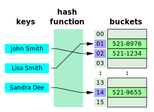

**Hash table** (also **hash map**) is a data structure that can map keys to values. A hash table uses a hash function to compute an index into an array of buckets or slots, from which the corresponding value can be found.



We will go through a basic Hash Map implementation in C++ with generic type key-value pairs by using templates. It is genuinely not a production-ready implementation of HashMap class, however it simply shows how this data structure can be implemented in C++.

Below, HashNode class represents each bucket node in the table with `key()` and `value()` accessors for corresponding pair elements. It also includes a pointer to the next node with same key.

```
// HashNode.h
// Hash node class template
template <typename K, typename V>
class HashNode {
public:
    HashNode(const K &key, const V &value) :
    key(key), value(value), next(NULL) {
    }

    K getKey() const {
        return key;
    }

    V getValue() const {
        return value;
    }

    void setValue(V value) {
        HashNode::value = value;
    }

    HashNode *getNext() const {
        return next;
    }

    void setNext(HashNode *next) {
        HashNode::next = next;
    }

private:
    // key-value pair
    K key;
    V value;
    // next bucket with the same key
    HashNode *next;
};

```

The hash function ideally assigns each key to a unique bucket, but most hash table designs assume that hash collisions can occur. My [hash function](http://en.wikipedia.org/wiki/Hash_map#Choosing_a_good_hash_function) just returns the remainder when the key is divided by the hash table size.
By user, custom hash function class with `operator()` method implementation should be defined according to the key distribution. i.e. if the range of key values is very small, then most of the hash table is not used and chains get longer.

```
// KeyHash.h
// Default hash function class
template <typename K>
struct KeyHash {
    unsigned long operator()(const K& key) const
    {
        return reinterpret_cast<unsigned long>(key) % TABLE_SIZE;
    }
};
```

Below is the Hash Map implementation in C++. HashMap class contains the hash table, which is a double pointer to HashNode class and default table size in constant is used to construct this hash table.

In addition, the class contains `get(key)` function to access mapped value by key, `put(key,value)` function to put key-value pair in table and `remove(key)` function to remove hash node by key. For collision resolution, [separate chaining](http://en.wikipedia.org/wiki/Hash_map#Separate_chaining) strategy has been used.

```
// HashMap.h
// Hash map class template
template <typename K, typename V, typename F = KeyHash<K>>
class HashMap {
public:
    HashMap() {
        // construct zero initialized hash table of size
        table = new HashNode<K, V> *[TABLE_SIZE]();
    }

    ~HashMap() {
        // destroy all buckets one by one
        for (int i = 0; i < TABLE_SIZE; ++i) {
            HashNode<K, V> *entry = table[i];
            while (entry != NULL) {
                HashNode<K, V> *prev = entry;
                entry = entry->getNext();
                delete prev;
            }
            table[i] = NULL;
        }
        // destroy the hash table
        delete [] table;
    }

    bool get(const K &key, V &value) {
        unsigned long hashValue = hashFunc(key);
        HashNode<K, V> *entry = table[hashValue];

        while (entry != NULL) {
            if (entry->getKey() == key) {
                value = entry->getValue();
                return true;
            }
            entry = entry->getNext();
        }
        return false;
    }

    void put(const K &key, const V &value) {
        unsigned long hashValue = hashFunc(key);
        HashNode<K, V> *prev = NULL;
        HashNode<K, V> *entry = table[hashValue];

        while (entry != NULL && entry->getKey() != key) {
            prev = entry;
            entry = entry->getNext();
        }

        if (entry == NULL) {
            entry = new HashNode<K, V>(key, value);
            if (prev == NULL) {
                // insert as first bucket
                table[hashValue] = entry;
            } else {
                prev->setNext(entry);
            }
        } else {
            // just update the value
            entry->setValue(value);
        }
    }

    void remove(const K &key) {
        unsigned long hashValue = hashFunc(key);
        HashNode<K, V> *prev = NULL;
        HashNode<K, V> *entry = table[hashValue];

        while (entry != NULL && entry->getKey() != key) {
            prev = entry;
            entry = entry->getNext();
        }

        if (entry == NULL) {
            // key not found
            return;
        }
        else {
            if (prev == NULL) {
                // remove first bucket of the list
                table[hashValue] = entry->getNext();
            } else {
                prev->setNext(entry->getNext());
            }
            delete entry;
        }
    }

private:
    // hash table
    HashNode<K, V> **table;
    F hashFunc;
};

```

As an example usage, you first create a container by template initialising and put key-value pairs in it. Then, you can get or remove elements from the map. If the key searched does not exist, false is returned and value is not updated.

```
// HashMapTest.cpp

struct MyKeyHash {
    unsigned long operator()(const int& k) const
    {
        return k % 10;
    }
};

HashMap<int, string, MyKeyHash> hmap;
hmap.put(1, "val1");
hmap.put(2, "val2");
hmap.put(3, "val3");

string value;
hmap.get(2, value);
cout << value << endl;
bool res = hmap.get(3, value);
if (res)
    cout << value << endl;
hmap.remove(3);
res = hmap.get(3, value);
if (res)
    cout << value << endl;
```

This is basic and complete hash map, but some of the expected functionality is missing. I can call some of them:
* Iterators for traversal,
* comparator for key comparisons,
* capacity and size functions,
* load factor and rehashing,
* allocator for dynamic memory allocations, and
* thread safety.